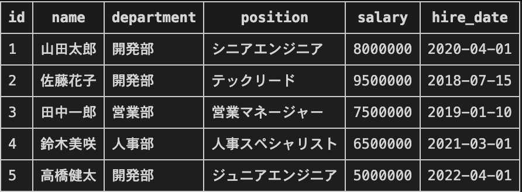
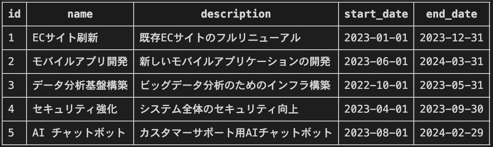

# MCPサーバー入門
## 15分でわかるModel Context Protocol

社内LT発表

---

# アジェンダ

1. **MCPとは何か？**
2. **MCPサーバーの基本構成**
3. **実装デモ：モック会社DB**
4. **実際のコード解説**
5. **デモンストレーション**
6. **まとめ**

---

# MCP（Model Context Protocol）とは？

- **AI Assistant**と**外部システム**をつなぐ標準プロトコル
- JSONベースの通信規格
- （Claudeを開発している）Anthropic社が開発・オープンソース化
- **サーバー/クライアント**アーキテクチャ
---
# MCPの目的
## 従来の問題
- AIがリアルタイムデータにアクセスできない
- 各システムとの連携が複雑

## MCPの解決策
- **統一されたインターフェース**
- **標準化された通信方式**

---

# MCPサーバーの基本構成

## 3つの主要コンポーネント

### 1. **Resources（リソース）**
- データソースへのアクセス
- 例：データベース、ファイル、API

### 2. **Tools（ツール）**
- 実行可能な操作
- 例：検索、更新、計算

### 3. **Prompts（プロンプト）**
- 再利用可能なプロンプトテンプレート

---

# 今回のデモ：モック会社DB

## 実装内容
- **SQLite**データベース
- **従業員情報**の管理
- **プロジェクト情報**の管理

## 提供機能
- 🔍 従業員検索
- 📊 プロジェクト状態取得
- 📈 従業員数カウント
- 📋 データ一覧表示
- 🤖 自然言語検索

---

# データベース
## 従業員テーブル


---
# データベース
## プロジェクトテーブル


---

# コード解説：サーバー初期化

```python
from mcp.server import Server
import mcp.server.stdio

# サーバーインスタンスを作成
server = Server("company-data-server")

# データベース接続
def get_db_connection():
    return sqlite3.connect("company_data.db")
```

## ポイント
- サーバー名の設定
- データベース接続の管理
- 非同期処理の活用

---

# コード解説：リソース定義

```python
@server.list_resources()
async def handle_list_resources() -> list[Resource]:
    return [
        Resource(
            uri="company://employees",
            name="従業員一覧",
            description="全従業員の情報",
            mimeType="application/json",
        ),
        Resource(
            uri="company://projects", 
            name="プロジェクト一覧",
            description="全プロジェクトの情報",
            mimeType="application/json",
        ),
    ]
```

---

# コード解説：ツール定義

```python
@server.list_tools()
async def handle_list_tools() -> list[Tool]:
    return [
        Tool(
            name="search_employees",
            description="従業員を検索する",
            inputSchema={
                "type": "object",
                "properties": {
                    "department": {"type": "string"},
                    "position": {"type": "string"},
                    "name": {"type": "string"}
                }
            },
        ),
        Tool(
            name="natural_language_query",
            description="自然言語でデータベースを検索",
            inputSchema={
                "type": "object",
                "properties": {
                    "query": {"type": "string"}
                },
                "required": ["query"]
            },
        ),
        # 他のツールも同様...
    ]
```

---

# コード解説：ツール実行

```python
@server.call_tool()
async def handle_call_tool(name: str, arguments: dict):
    if name == "search_employees":
        result = await search_employees(arguments)
        return [TextContent(
            type="text", 
            text=json.dumps(result, ensure_ascii=False, indent=2)
        )]
    # ...
```

## 実際の検索処理
```python
async def search_employees(args):
    conn = get_db_connection()
    cursor = conn.cursor()
    
    query = "SELECT * FROM employees WHERE 1=1"
    params = []
    
    if args.get("department"):
        query += " AND department = ?"
        params.append(args["department"])
    # ...
```

---

# 自然言語検索機能（NEW！）

## 機能概要
- **GPT-4**を使用した自然言語からSQLへの変換
- データベーススキーマ情報の自動取得
- セキュリティ対策（危険なSQLの拒否）

## 使用例
- 「開発部の従業員を全て表示して」
- 「年収が700万円以上の従業員を検索」
- 「進行中のプロジェクトの一覧を見せて」

## アーキテクチャ
```
自然言語クエリ → GPT-4 → SQL生成 → 安全性チェック → 実行
```

---

# セットアップ手順

## 1. 環境構築
```bash
# 仮想環境作成
pyenv virtualenv 3.11.7 mcp-demo
pyenv local mcp-demo

# 依存関係インストール
pip install -r requirements.txt
```

## 2. OpenAI APIキーの設定
```bash
export OPENAI_API_KEY='your-api-key-here'
```

## 3. データベース初期化
```bash
python database.py
```

## 4. サーバー起動
```bash
python server_new.py
```

---

# 実際のデモンストレーション

## 1. データベース初期化
- サンプルデータの作成
- 従業員5名、プロジェクト5件

## 2. MCPサーバー動作確認
- 従業員検索機能
- プロジェクト状態取得
- 従業員数カウント
- **自然言語検索機能**（NEW！）

## 3. クライアントとの連携
- JSON形式でのデータ交換
- リアルタイム検索

---

# MCPの利点

## 🚀 開発効率
- 標準化されたインターフェース
- 再利用可能なコンポーネント

## 🔧 保守性
- 統一された通信方式
- デバッグが容易

## 📈 拡張性
- 新しいリソース・ツールの追加が簡単
- 複数のデータソースに対応

## 🛡️ セキュリティ
- 明確な権限管理
- 安全なデータアクセス

---

# 応用例・実用シーン

## 社内システム連携
- 人事システム ↔ AI Assistant
- 在庫管理システム ↔ AI Assistant
- 売上データ ↔ AI Assistant

## 外部API連携
- GitHub API
- Slack API
- Google Drive API

## データ分析
- リアルタイム分析
- レポート自動生成
- 業務効率化
- **自然言語でのデータクエリ**

---

# まとめ

## MCPサーバーの特徴
- ✅ **標準化された通信プロトコル**
- ✅ **簡潔な実装**
- ✅ **高い拡張性**
- ✅ **AI Assistantとの自然な連携**

## 今後の展開
- 他のデータベースシステムへの対応
- 複数のMCPサーバーの連携
- 更なる自動化・効率化

---

# 質疑応答

## ご質問をお待ちしております！

### 参考資料
- [MCP公式ドキュメント](https://github.com/modelcontextprotocol/servers)
- [サンプルコード](https://github.com/your-repo/mcp-demo)

### 今回のデモコード
- `database.py` - データベース初期化
- `server_new.py` - MCPサーバー実装
- `text_to_sql.py` - 自然言語検索機能
- `test_natural_language.py` - テストスクリプト
- `requirements.txt` - 依存関係

**ありがとうございました！**